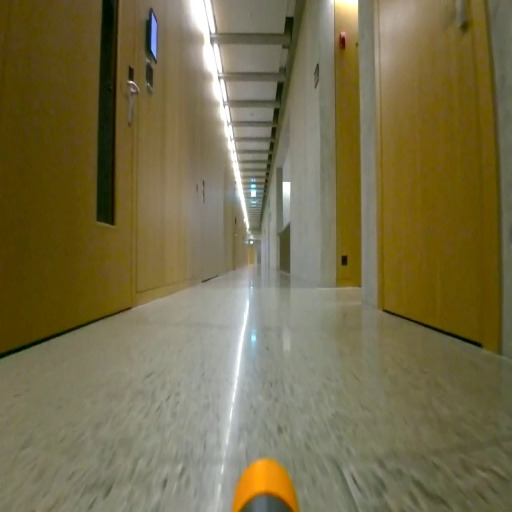

# Anomaly Detection for Robots
This is the main repository for the dataset Dataset for Sensing Anomalies as Potential Hazards in Mobile Robots.
The dataset can be find on Zenodo at https://zenodo.org/record/5520933

## Papers
<!-- The relative video is available at TODO -->
### <em>Sensing Anomalies as Potential Hazards: Datasets and Benchmarks</em>
    We consider the problem of detecting, in the visual sensing data stream of an 
    autonomous mobile robot, semantic patterns that are unusual (i.e., anomalous) with
    respect to the robot's previous experience in similar environments.  These 
    anomalies might indicate unforeseen hazards and, in scenarios where failure is 
    costly, can be used to trigger an avoidance behavior.  We contribute three novel 
    image-based datasets acquired in robot exploration scenarios, comprising a total
    of more than 200k labeled frames, spanning various types of anomalies.  On these 
    datasets, we study the performance of an anomaly detection approach based on 
    autoencoders operating at different scales.

To appear at the [23rd TAROS Conference](https://ukaeaevents.com/23rd-taros/)

DOI: TODO

ArXiv: TODO

### <em>An Outlier Exposure Approach to Improve Visual Anomaly Detection Performance for Mobile Robots.</em>
    We consider the problem of building visual anomaly detection systems for mobile 
    robots. Standard anomaly detection models are trained using large datasets composed 
    only of non-anomalous data. However, in robotics applications, it is often the case 
    that (potentially very few) examples of anomalies are available. We tackle the 
    problem of exploiting these data to improve the performance of a Real-NVP anomaly 
    detection model, by minimizing, jointly with the Real-NVP loss, an auxiliary outlier 
    exposure margin loss. We perform quantitative experiments on a novel dataset (which 
    we publish as supplementary material) designed for anomaly detection in an indoor 
    patrolling scenario. On a disjoint test set, our approach outperforms alternatives 
    and shows that exposing even a small number of anomalous frames yields significant 
    performance improvements.

Published in [Robotics and Automation Letters](https://www.ieee-ras.org/publications/ra-l) 
<!-- volume .... year ... -->

DOI: https://doi.org/10.1109/LRA.2022.3192794

ArXiv: TODO

## Codes
Under `./code` you can find the code used for the <em>TAROS</em> paper under `./code/OLD_CODE` and the code for <em>RAL</em> paper under `./code/Latest`.

We use python 3.8 and the requirements in `./code/Latest/requirements.txt`; follow the README.md under the `./code/Latest` to install and run the models.

# Description
The dataset is composed of three different scenarios:
- Tunnel
- Factory
- Corridors

In the version of the dataset of the <em>TAROS</em> paper the Corridors scenario has 52'607 samples and 8 anomalies. 
In the <em>RAL</em> paper we extended this scenario up to 132'838 frames and 16 anomalies.
<figure>

<figcaption align = "center">Examples of samples from the <em>RAL</em> paper </figcaption>
</figure>

### Funding
This work was supported as a part of NCCR Robotics, a National Centre of Competence in Research, funded by the Swiss National Science Foundation (grant number 51NF40\_185543) and by the European Commission through the Horizon 2020 project 1-SWARM, grant ID 871743.

# How to cite
If you use this dataset please cite it using the following bib

    @ARTICLE{mantegazza2022outlier,
        author={Mantegazza, Dario and Giusti, Alessandro and Gambardella, Luca Maria and Guzzi, Jérôme}, 
        journal={IEEE Robotics and Automation Letters},
        title={An Outlier Exposure Approach to Improve Visual Anomaly Detection Performance for Mobile Robots.},
        year={2022}, 
        volume={},
        number={}, 
        pages={1-8}, 
        doi={10.1109/LRA.2022.3192794}
      }
# Frames Examples
Across the three scenarios described before, we recorded various normal situations and numerous anomalies.
The anomalies are the following:
### Tunnel Anomalies

  
Click for high resolution examples

<figure class="image">

<figcaption><b>Normal</b> - Empty underground man made tunnel</figcaption>
</figure>

<figure>

<figcaption><b>Wet</b> - Water condensation on the tunnel walls and ceiling</figcaption>
</figure>

<figure>

<figcaption><b>Root</b> - Roots coming down from the ceiling and walls</figcaption>
</figure>

<figure>

<figcaption><b>Dust</b> - Dust moved by the drone </figcaption>
</figure>

### Factory Anomalies

  
Click for high resolution examples

<figure>

<figcaption><b>Normal</b> - Empty factory facility</figcaption>
</figure>

<figure>

<figcaption><b>Mist</b> - Mist coming from a smoke machine</figcaption>
</figure>

<figure>

<figcaption><b>Tape</b> - Signaling tape stretched across the facility</figcaption>
</figure>

### Corridors Anomalies

  
Click for high resolution examples

<figure>

<figcaption><b>Normal</b> - Empty university corridors (on different floors)</figcaption>
</figure>

<figure>

<figcaption><b>Box</b> - Cardboard boxes placed in front/near of the robot</figcaption>
</figure>

<figure>

<figcaption><b>Cable</b> - Various cables layed on the floor around and in front of the robot</figcaption>
</figure>

<figure>

<figcaption><b>Debris</b> - Various debris </figcaption>
</figure>

<figure>

<figcaption><b>Defects</b> - Defects of the robot</figcaption>
</figure>

<figure>

<figcaption><b>Door</b> - Open doors where doors should be closed</figcaption>
</figure>

<figure>

<figcaption><b>Human</b> - Human presence</figcaption>
</figure>

<figure>

<figcaption><b>Clutter</b> - Chairs, tables and furniture moved around the corridor</figcaption>
</figure>

<figure>

<figcaption><b>Foam</b> - Foam placed on the floor</figcaption>
</figure>

<figure>

<figcaption><b>Sawdust</b> - Sawdust placed on the floor</figcaption>
</figure>

<figure>

<figcaption><b>Cellophane</b> - Cellophane foil stretched between walls</figcaption>
</figure>

<figure>

<figcaption><b>Floor</b> - Fake flooring different than original floor</figcaption>
</figure>

<figure>

<figcaption><b>Screws</b> - Small screws and bolts placed in front of the robot</figcaption>
</figure>

<figure>

<figcaption><b>Water</b> - Water puddle in front of robot</figcaption>
</figure>

<figure>

<figcaption><b>Cones</b> - Multiple orange cones placed in the corridor</figcaption>
</figure>

<figure>

<figcaption><b>Hanging cables</b> - Cables hanging from the ceiling</figcaption>
</figure>

